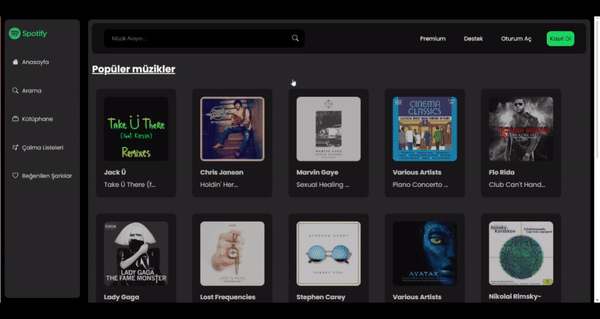

---

# Spotify Klonu

HTML, SCSS ve JavaScript ile oluşturulmuş web tabanlı bir Spotify klon uygulaması. Bu uygulama, kullanıcılara müzik arama, arama sonuçlarını görüntüleme ve müzik parçalarını oynatma veya duraklatma imkanı sunar. Müzik verileri bir API'den alınmaktadır.

## Ekran Görüntüleri



## Özellikler

- **Müzik Arama**: Kullanıcılar, bir sorgu girerek müzik arayabilirler.
- **Sonuçları Görüntüleme**: Uygulama, arama sonuçlarını şarkı başlıkları, sanatçılar ve albüm bilgileri ile birlikte görüntüler.
- **Müzik Oynatma/Duraklatma**: Kullanıcılar, arama sonuçlarından müzik parçalarını oynatabilir veya duraklatabilirler.

## Kullanılan Teknolojiler

- **HTML**: Uygulamanın yapısı ve düzeni.
- **SCSS**: Uygulamanın stilini CSS ön işleme ile oluşturma.
- **JavaScript**: API etkileşimleri de dahil olmak üzere, uygulamanın mantığı ve işlevselliği.

## API Entegrasyonu

Uygulama, müzik verilerini üçüncü taraf bir API'den alır. API anahtarınızın ve veriye erişim izinlerinizin olduğundan emin olun.

## Kurulum ve Kurulum

1. **Depoyu klonlayın:**

   ```bash
   git clone https://github.com/cengo14/javascript-spotify-clone-project.git
   ```

2. **Proje dizinine gidin:**

   ```bash
   cd javascript-spotify-clone-project
   ```

3. **`index.html` dosyasını tarayıcınızda açın:**

   Kod editörünüzdeki herhangi bir canlı sunucu uzantısını kullanabilir veya dosyayı doğrudan bir tarayıcıda açabilirsiniz.

## Kullanım

1. **Müzik Arama:**
   - Arama çubuğuna bir şarkı adı, sanatçı veya albüm adı girin.
   - Arama düğmesine basın veya 'Enter' tuşuna basarak sonuçları görüntüleyin.

2. **Müzik Oynatma/Duraklatma:**
   - Herhangi bir parçanın yanındaki oynatma düğmesine tıklayarak çalmaya başlayın.
   - Tekrar tıklayarak parçayı duraklatın.

## Katkıda Bulunma

Bu projeye katkıda bulunmak için bir sorun açabilir veya bir pull request gönderebilirsiniz. Lütfen [katkı kılavuzunu](CONTRIBUTING.md) takip edin.

## Lisans

Bu proje MIT Lisansı ile lisanslanmıştır. Daha fazla bilgi için [LICENSE](LICENSE) dosyasına bakın.

## Teşekkür

- [Spotify](https://www.spotify.com) platformundan ilham alınmıştır.
- Müzik verileri [RapidApi](https://rapidapi.com/Glavier/api/spotify23/playground/apiendpoint_1dc51f1b-a2c6-4f9a-9c6c-32019c7301b2) tarafından sağlanmaktadır.

## İletişim

Herhangi bir soru veya görüşleriniz için lütfen [email adresiniz] ile iletişime geçin.

---
